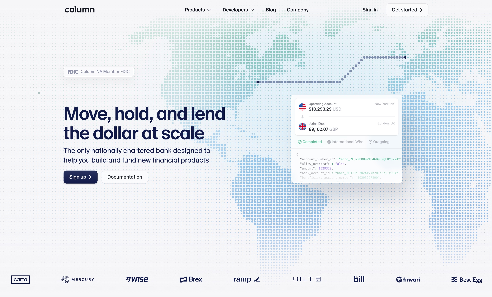
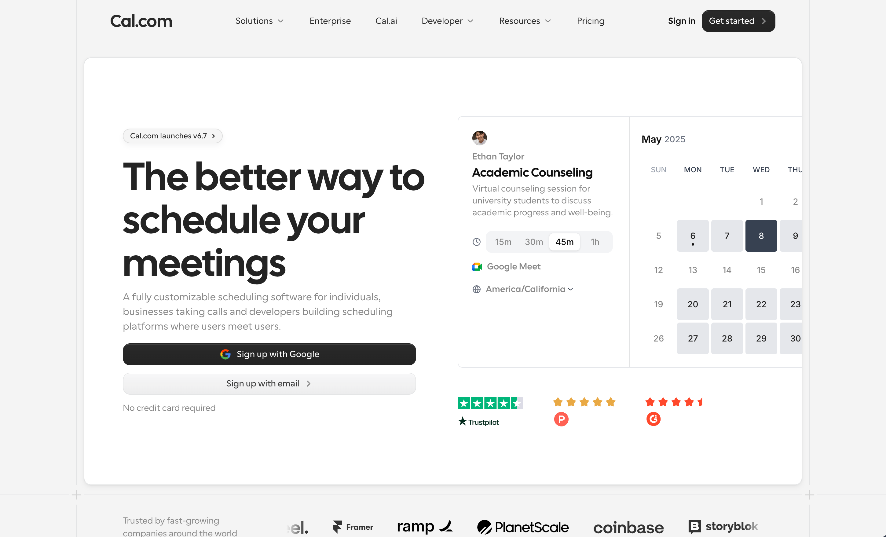
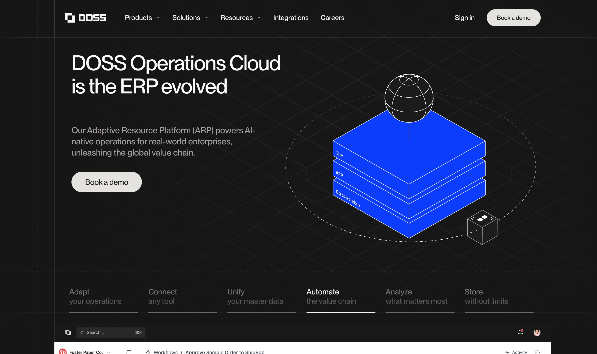
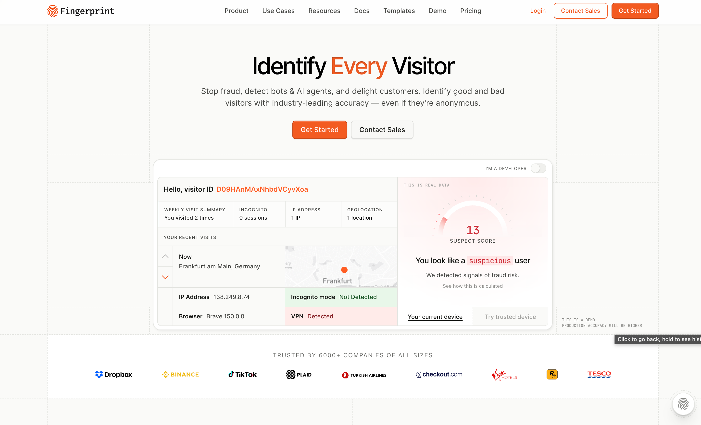
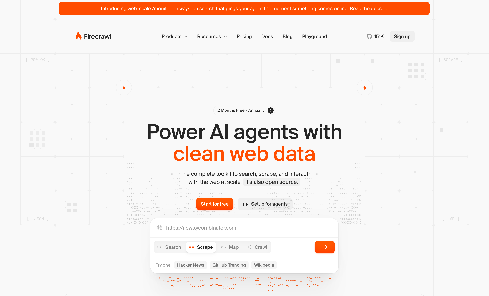

# Styleguide UAPP — токени бренду та візуальні референси

## 1. Примітивні токени

### 1.1 Primary — Ultramarine

| Ступінь | HEX |
|---|---|
| 50 | `#E6E8FF` |
| 100 | `#CBD3FF` |
| 200 | `#A8B5FF` |
| 300 | `#8091FF` |
| 400 | `#546BFF` |
| 500 | `#2944FF` |
| 600 | `#011EFF` |
| 700 | `#0116BF` |
| 800 | `#000F7D` |
| 900 | `#00073C` |
| 950 | `#000000` |

### 1.2 Neutral — Gray

| Ступінь | HEX |
|---|---|
| 50 | `#F9FAFB` |
| 100 | `#F3F4F6` |
| 200 | `#E5E7EB` |
| 300 | `#D1D5DB` |
| 400 | `#9CA3AF` |
| 500 | `#6B7280` |
| 600 | `#4B5563` |
| 700 | `#374151` |
| 800 | `#1F2937` |
| 900 | `#111827` |
| 950 | `#040816` |

### 1.3 Base

| Токен | HEX |
|---|---|
| Black | `#000000` |
| White | `#FFFFFF` |

Secondary-кольори (`#578ADA`, `#9A98FF`) розглядались і виключені з палітри за рішенням — не використовувати.

## 2. Типографіка

| Роль | Шрифт |
|---|---|
| Заголовки (H1–H3, display) | e-Ukraine Head |
| Основний текст (body, UI, лейбли) | e-Ukraine |

Обидва — геометричний гротеск без засічок; антикви в системі немає, тож напрямок «Engraved Trust» (research 02, §5, напрямок C) неактуальний.

## 3. Лого

Актив: [`assets/logo-uapp.svg`](../assets/logo-uapp.svg) — фінальний знак «UAPP», формою не змінювати.

| Полотно | Заливка |
|---|---|
| Темне | `#FFFFFF` |
| Світле | `#000000` |

## 4. Семантичні токени — світла і темна поверхня одночасно

Контраст порахований за WCAG 2.1 (формула відносної яскравості sRGB). Темна база навмисно взята `ultramarine/900` (`#00073C`), а не `950` (чистий чорний) — чорний + електричний ultramarine/600 як пара дрейфує у крипто/кібер-естетику (ризик, зафіксований у `02-visual-benchmark.md` §5, напрямок B); navy-900 читається як банківський, не кіберпанковий.

| Роль | Світла поверхня | Контраст | Темна поверхня | Контраст |
|---|---|---|---|---|
| Background / base | white `#FFFFFF` | — | ultramarine/900 `#00073C` | — |
| Surface / card (elevated) | white + border gray/200 | — | gray/900 `#111827` | — |
| Border / divider | gray/200 `#E5E7EB` | — | gray/800 `#1F2937` | — |
| Text — heading (ink) | ultramarine/800 `#000F7D` | 15:1 на білому | white `#FFFFFF` | 19:1 на navy/900 |
| Text — body | gray/700 `#374151` | 7.6:1 (AAA) | gray/200 `#E5E7EB` | 15.5:1 |
| Text — muted / caption | gray/500 `#6B7280` | 4.8:1 (мінімум AA) | gray/400 `#9CA3AF` | 7.6:1 |
| Text — disabled / decorative only | gray/400 і світліше — **не текст**, лише декор/бордери (2.5:1, провалює навіть велике накреслення) | — | gray/600 і темніше — аналогічно уникати як текст | — |
| Accent / CTA / посилання | ultramarine/600 `#011EFF` | 8:1 | ultramarine/400 `#546BFF` — тільки великий текст/UI-лейбли, не body (≈4.5:1, межа) | ≈4.5:1 |
| Accent hover/pressed | ultramarine/700 `#0116BF` | — | ultramarine/300 `#8091FF` | — |
| Кнопка-заливка + текст | фон `#011EFF` + текст `#FFFFFF` | 8:1 (той самий разворот) | фон `#011EFF` + текст `#FFFFFF` | 8:1 |

### Ключове правило, що випливає з розрахунків

**`ultramarine/600` і темніші ступені (700/800/950) ніколи не використовувати як колір тексту на темному полотні** — контраст падає до ~2.4–2.6:1. На темних секціях `600`/`700`/`800` — тільки заливка, лінія, великий графічний елемент; сам текст завжди gray/white-шкала.

**На світлому полотні `gray/400` і світліше — не текст**, тільки бордери/розділювачі/декор (мінімум для тексту — `gray/500`, 4.8:1).

## 5. Зв'язок із напрямками (research 02 §5)

- **Напрямок A «Institutional Grid»** — основний, тепер повністю покритий токенами: світла база, ultramarine/800 як «чорнило», ultramarine/600 як єдиний акцент, e-Ukraine Head/e-Ukraine.
- **Напрямок B «Dark Precision»** — темні секції всередині A, полотно `ultramarine/900`, текст білий/gray/200, акцент лише формою (лінії/заливки), не текстом.
- **Напрямок C «Engraved Trust»** — знято, немає антикви в брендбуці.

## 6. Рух / мікроанімації

Це пропозиція дизайнера (ефекти й рух — зона відповідальності дизайнера, не брендбуку). Фіксується сам факт, що такий інструментарій доречний для UAPP, без конкретного темпу, тривалості чи виконання — вони узгоджуються на етапі макету.

Категорії, які варто розглянути:

- Анімовані діаграми процесів/пайплайнів — наочно показують складні продукти («вхід → обробка → результат»), не перевантажуючи текстом.
- Легкі hover/scroll-мікроінтеракції на картках, кнопках, елементах навігації.
- Анімовані outlined-ілюстрації/схеми — продовжують візуальну мову hero в інших блоках, замість стокових ілюстрацій.

## 7. Ілюстрації та діаграми

Як і розд. 6, це не задані клієнтом токени, а робочий орієнтир дизайнера. Стилістику ілюстрацій і діаграм можна брати з сайтів-прикладів, зібраних у [розд. 8](#8-візуальні-референси): прості геометричні ілюстрації та іконки (Doss), реальні схеми, дата-візуалізації й UI-мокапи замість стокових картинок і абстрактних метафор (Column, Fingerprint), технічний контент в акуратних контейнерах (Firecrawl). Кольори й типографіка в ілюстраціях — тільки з токенів розд. 1–2 (нейтральна база + акцент ultramarine).

Зібрані приклади у фігма-файлі концепту:

- [Приклади ілюстрацій](https://www.figma.com/design/Y4hZIZjrpGokO2m0mYgYBC/UAPP-GROUP-Redesign-Concept?node-id=21-30710&t=eMWeNJblJlgjnbw0-11)
- [Приклади діаграм](https://www.figma.com/design/Y4hZIZjrpGokO2m0mYgYBC/UAPP-GROUP-Redesign-Concept?node-id=19-13648&t=eMWeNJblJlgjnbw0-11)

## 8. Візуальні референси

Як і розд. 6–7, це не мандат клієнта, а добірка дизайнера: пʼять сайтів, що задають цільову візуальну мову редизайну. Кожен розібраний нижче за схемою «стиль → що беремо для UAPP».

Ці ж сайти зібрані у [фігма-файлі концепту](https://www.figma.com/design/Y4hZIZjrpGokO2m0mYgYBC/UAPP-GROUP-Redesign-Concept?node-id=19-57&t=eMWeNJblJlgjnbw0-11) — сторінки перенесені у Figma браузерним розширенням, тому можливі артефакти імпорту (зсуви верстки, підміна шрифтів, розтягнуті зображення). Першоджерело — живі сайти та скриншоти нижче; Figma-копії зручні для розмітки й порівняння поруч.

### 8.1. [Column](https://column.com) — банківська інфраструктура

**Стиль:** максимально стриманий і «дорослий»: білий простір, чорнильний текст, оверсайз-заголовки без жодного декору. Замість стокових картинок — реальні інтерфейси, фрагменти коду та жива стрічка транзакцій. Комплаєнс і цифри (uptime, ліцензії) — прямо в основному тексті, а не дрібним шрифтом у футері.

**Що беремо для UAPP:**
- Головний еталон тону: «інженери, яким можна довірити гроші» — довіра через конкретику, а не через гасла.
- Ієрархія через масштаб типографіки, а не через кольори й прикраси.
- Показ продукту реальними даними/схемами замість абстрактних ілюстрацій.

### 8.2. [Cal.com](https://cal.com) — open-source планування зустрічей

**Стиль:** майже монохром — чорний текст на білому, великі спокійні заголовки, багато повітря. Продукт показаний чистими скріншотами інтерфейсу; секції розділені простором, а не рамками й фонами. Мінімум кольору, нуль візуального шуму.

**Що беремо для UAPP:**
- Дисципліна «типографіка — головний герой сторінки»: наш аналог — e-Ukraine Head у великих заголовках.
- Розділення секцій повітрям замість декоративних фонів — преміальність через стриманість.
- Приклад того, як мінімалізм не виглядає порожньо, коли є чіткий ритм блоків.

### 8.3. [Doss](https://www.doss.com) — операційна платформа (ERP)

**Стиль:** великими декларативні заголовки («ERP is broken. We created something new»). Модульна сітка, прості геометричні ілюстрації та іконки, короткі впевнені формулювання. Складний enterprise-продукт поданий легко і зрозуміло.

**Що беремо для UAPP:**
- Сміливий масштаб заголовків: короткі декларативні фрази замість довгих описових речень.
- Ритм сторінки: чергування текстових блоків і продуктових карток у чистій сітці.
- Приклад, як «нудна» B2B-тема виглядає сучасно без кричущих ефектів.

### 8.4. [Fingerprint](https://fingerprint.com) — device intelligence / антифрод

**Стиль:** технічна точність як естетика: UI-мокапи, фрагменти коду й дата-візуалізації замість фотографій. Нейтральна база з одним фірмовим акцентним кольором. Метрики точності та масштабу — як головний аргумент довіри.

**Що беремо для UAPP:**
- Подача через дані: цифри, метрики, схеми — мова, якою говорять із CTO та Head of Payments.
- Один акцентний колір на нейтральній базі — у нас цю роль грає ultramarine.
- Баланс «технічно, але не перевантажено» — складний продукт лишається сканованим для C-level.

### 8.5. [Firecrawl](https://www.firecrawl.dev) — інструмент для розробників

> ⚠️ **Важливо: беремо без фонових анімацій.** Референс — верстка, типографіка й модульна структура; фонові ефекти для нас зайві (дрейф у «крипто/кібер»-естетику, якої свідомо уникаємо).

**Стиль:** світла база, високий контраст, технічний контент в акуратних контейнерах, чіткі модульні секції. Developer-first подача: технічно, впевнено, без залякування.

**Що беремо для UAPP:**
- Чергування «текст → візуальна демонстрація» в модульних секціях — сторінка веде читача блок за блоком.
- Акуратні контейнери для технічного контенту (схеми, діаграми процесів) — технічність виглядає доглянуто, а не «як термінал хакера».
- Легкість подачі складної технічної теми: впевнено, без перевантаження деталями.

### 8.6. Спільний знаменник — що це означає для нашого сайту

1. **Стриманість = довіра.** Нейтральна база, один акцент (ultramarine), нуль неону й «енергійних» градієнтів.
2. **Типографіка як головний виразний засіб.** Великі впевнені заголовки (e-Ukraine Head), багато повітря.
3. **Показуємо експертизу, а не метафори.** Реальні схеми, діаграми процесів, метрики — замість стокових фото та абстракцій.
4. **Цифри замість прикметників.** Досвід, масштаб, комплаєнс — конкретикою у видимих місцях сторінки.
5. **Рух — дозовано.** Один виразний ефект у hero, далі — тільки делікатні hover/scroll-мікроінтеракції; жодних фонових анімацій на всю сторінку.

> Детальний розбір ширшого ряду бенчмарків (14 fintech-сайтів + анти-патерни) — у
> [`../research/02-visual-benchmark.md`](../research/02-visual-benchmark.md).

### 8.7. Додаткові посилання (без розбору, щоб не загубити)

- https://www.monad.com/ — тільки hero
- https://ramp.com/
- https://www.plain.com/
- https://mora.com/
